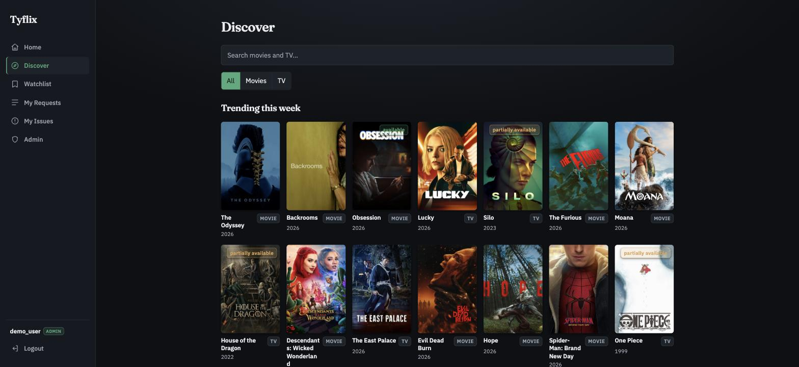
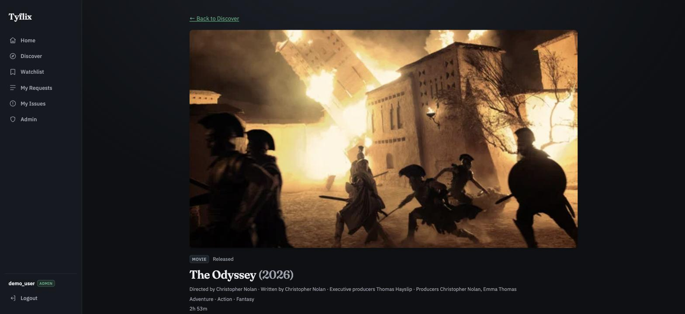
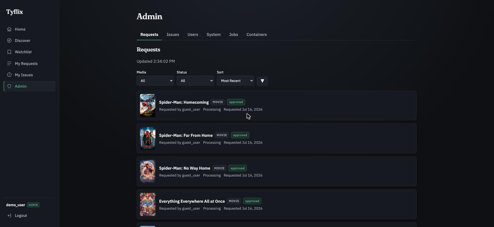

# Tyflix

Tyflix is a self-hosted web app that gives a Plex server a proper front door: browse and discover titles, request them in one click, see what is already in the library, and play it — all behind a Plex sign-in.

It is built on top of Seerr, the request manager in the Overseerr and Jellyseerr family, which handles the pipeline into Radarr and Sonarr. Tyflix adds the parts that Seerr leaves thin for my use: a poster-forward browse-and-discover experience, in-browser playback, per-user analytics, and an admin view of the server itself. The goal was a clean front end my household could use without ever touching the automation tools underneath.

**Live instance:** https://tyflix.tylerte.dev (signing in needs a Plex account with access to the server)

_Active project. Deployed and in daily use, and still being built out. The roadmap is at the bottom._

## Screenshots

Discover: browse global trending from TMDB, with live availability read from Plex.



Title page: artwork and details for a single movie or show.



Admin: manage requests that flow through to Radarr and Sonarr, with status and filters. Usernames here are demo labels.



## What it does

- Browse and search movies and TV from TMDB: trending, browse by genre, recommendations, cast and crew, collections, and studio and network pages.
- Browse your actual library: a Plex-style view of what is really on the server (Movies and TV), with sort, genre and unwatched filters, an A–Z jump rail, an adjustable poster size, and grid or detail layouts.
- Request a title in one click. Requests flow through Seerr into Radarr and Sonarr, which do the actual downloading and library management.
- Play a title in the browser. Movies and individual TV episodes stream from Plex through an in-page player, transcoded on the fly so anything in the library plays regardless of its source format.
- Show real availability on every title (in the library, partially available, or still processing), read live from Plex through Seerr.
- Report a problem with a title, such as bad audio or the wrong cut, and follow it through to resolution.
- Plex Watchlist support, per-user request quotas, and quality-profile selection at request time.
- An admin area with system and storage metrics, running jobs, container health, user management, and a per-user "watched versus requested" view that shows how much requested content actually gets watched.

## Architecture

Tyflix is a single Node service. It serves a JSON API and the built React app from the same origin.

- **Frontend:** React, Vite, and TypeScript. A dark, poster-forward interface with a persistent sidebar.
- **Backend:** Node, Express, and TypeScript. It holds every credential and talks to four upstreams: Plex for accounts and the library, Seerr for requests and media status and issues, TMDB for discovery metadata and images, and a small host-metrics service for the dashboard.
- **Auth:** users sign in with their Plex account over Plex's PIN flow. The browser only ever holds a signed, httpOnly session cookie. The Plex token stays on the server.
- **Playback:** to stream, the server mints a short-lived Plex *transient* token from the user's stored token and hands the browser Plex's own direct `plex.direct` address, so video goes straight from Plex to the in-page player and never passes through the tunnel. Plex transcodes on demand; the durable token never leaves the backend.
- **Deployment:** the whole app runs in Docker on a home server, on the same Docker network as Seerr. It is reachable from anywhere through a Cloudflare Tunnel, so no inbound ports are open on the home network. TLS terminates at Cloudflare's edge.

```
Browser --https--> Cloudflare edge --tunnel--> cloudflared --> Tyflix (Node)
                                                                 |-> Seerr --> Radarr / Sonarr
                                                                 |-> Plex
                                                                 |-> TMDB
```

(Only the control plane goes through the tunnel — video streams direct from the browser to Plex over HTTPS.)

## Notable engineering decisions

**Outbound-only public access (a reverse-invoke model).** The app runs at home but is reachable from anywhere, with no inbound port open on the network. Instead of forwarding a port through the router, which would put a service straight on the public internet, I moved access onto a broker-mediated, outbound-only model built on a Cloudflare Tunnel. A lightweight connector (cloudflared) runs next to the app and dials out to Cloudflare's edge, keeping a persistent connection open from the inside. Cloudflare acts as the broker: when a request arrives for the public hostname, the edge sends it back down that already-open connection to the connector, which passes it to the app over the local Docker network. Every connection starts inside the network and goes out, so the router never accepts unsolicited inbound traffic, and TLS and edge filtering happen at Cloudflare.

This is the same shape as an enterprise pattern like SAP Cloud Connector reaching SAP BTP: the on-premise side opens the tunnel outbound, and the cloud reverse-invokes back through it. The result is a home-hosted service that is publicly reachable while the network perimeter stays closed.

**Streaming video without pushing it through the tunnel.** Everything else in the app rides the outbound tunnel, but video is the deliberate exception. Proxying a movie through Cloudflare would be slow and outside the terms for that path, so playback streams straight from Plex to the browser instead. When a user hits play, the server mints a short-lived Plex *transient* token from their stored token — the long-lived token never reaches the browser — and returns Plex's own direct address, both a local and a remote one, so the player uses whichever it can actually reach. Plex transcodes on demand, forced to H.264, so anything in the library plays in a browser regardless of its source codec. The control plane stays behind the tunnel; only the video goes direct.

**Rate limiting that sees the real client.** Because the app sits behind the tunnel, every request arrives from the tunnel's address rather than the user's. A naive per-IP limiter would treat all traffic as one client. The limiter keys on the `CF-Connecting-IP` header that Cloudflare sets and overwrites, so a client cannot forge it, and falls back to the socket address for local development. The limit itself was tuned after a real finding: the admin dashboard polls a few endpoints every few seconds, and an early, tighter limit throttled the admin's own page inside a single window.

**Security that does not rely on hiding the code.** All authorization happens on the server. Every route checks the session, and admin routes check an admin permission bit that mirrors Seerr's model. The long-lived Plex token never leaves the backend. Security headers ship a Content-Security-Policy scoped to exactly what the app loads: posters from TMDB, fonts from Google, everything else same-origin. The one subtlety is the Plex login popup, which needs a Cross-Origin-Opener-Policy that lets the opener keep a handle on the popup so the sign-in flow can close it when the login completes.
**Joining two id systems.** Discovery is keyed by TMDB id, while Plex is keyed by its own rating keys. Availability and playability come from matching the two through Seerr's media records, so the app can show accurate status without guessing by title.

## Tech stack

- TypeScript across frontend and backend
- React and Vite, with hls.js for in-browser playback
- Node and Express
- Docker for packaging, Cloudflare Tunnel (cloudflared) for access
- Helmet and express-rate-limit for security headers and request throttling
- Integrations: Plex, Seerr, TMDB, Radarr, Sonarr

## Status and roadmap

Tyflix is deployed and in daily use on my home server, and it is still an active work in progress. It covers most of Seerr's user-facing surface, plus features Seerr does not have, like the per-user watched-versus-requested analytics.

In-browser playback now works for both movies and TV — pick a title or a specific episode, hit play, and it streams from Plex right in the page. That closes a nice loop: watching through Tyflix feeds the same watched-versus-requested numbers the analytics already report.

Since then it has grown a Plex-style **Library** (browse everything actually on the server, with sort, genre and unwatched filters, an A–Z jump rail, an adjustable poster size, and grid or detail layouts), in-player **audio-track and subtitle selection**, and **hardware-accelerated transcoding** on the server's Arc GPU. Further out: a client-side quality cap for constrained connections, a continue-watching rail, and per-user (rather than owner-based) watch state. The guiding idea is to keep integrating tools that already exist rather than rebuilding them, so Tyflix stays a thin, sharp layer over Plex and Seerr instead of a second copy of either.

## Notes

Tyflix is a personal, self-hosted project. It is not affiliated with Plex, and it does not host or distribute media. It manages access to a private Plex library. This repository holds the application code; deployment details specific to my own network are kept out of it.
