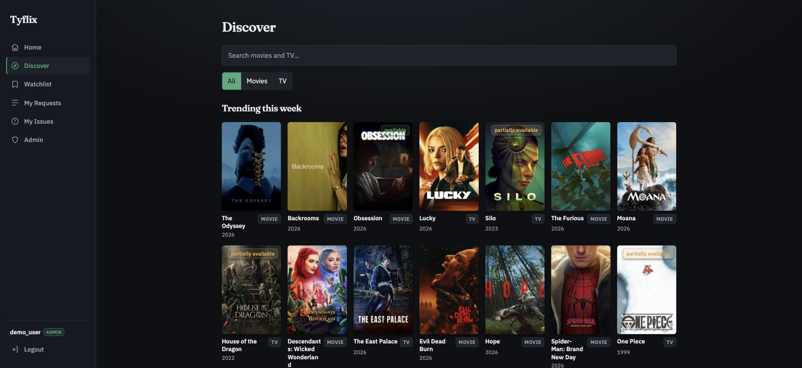
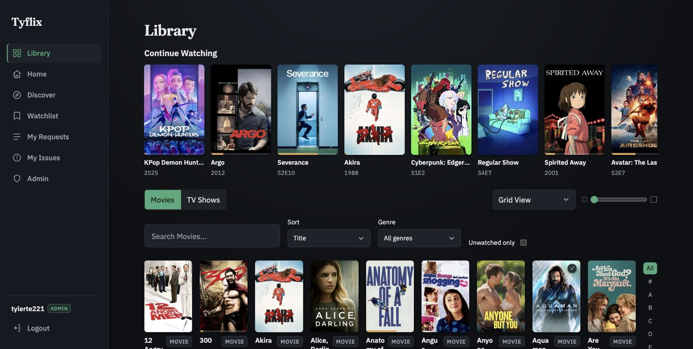
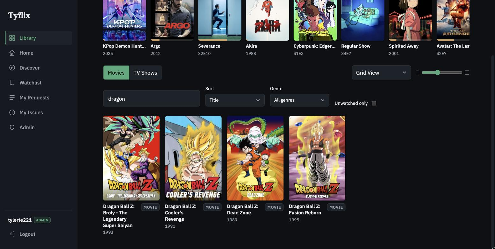
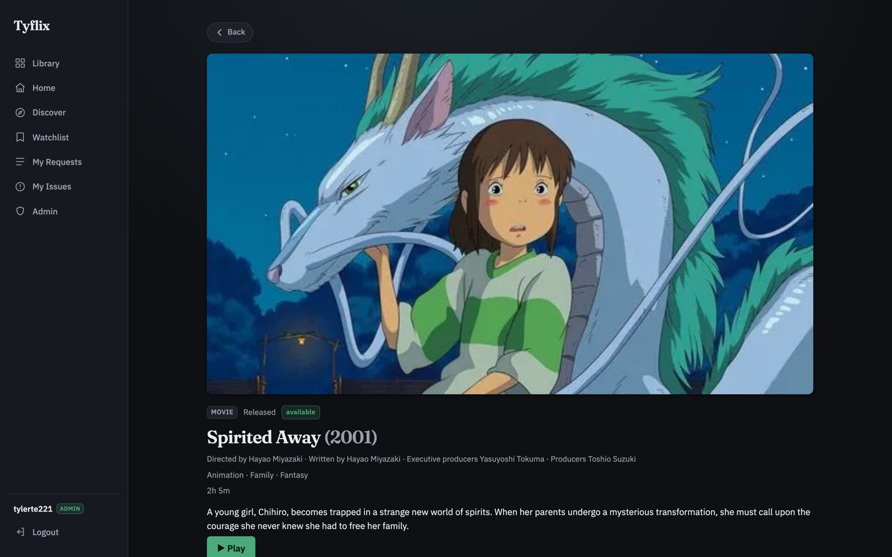
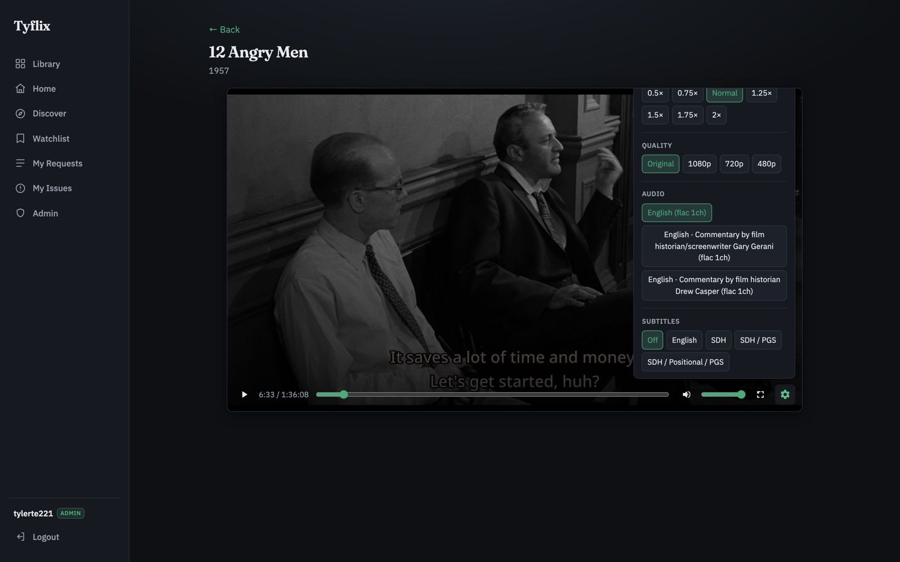
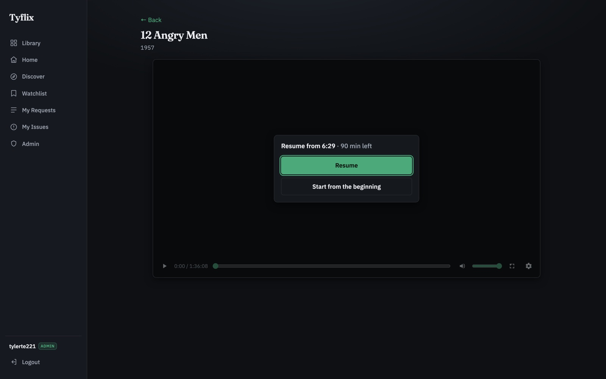
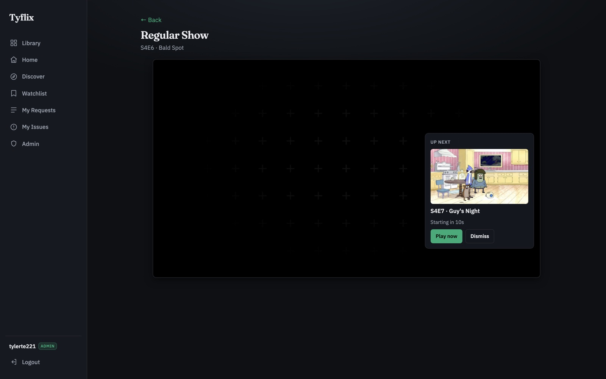
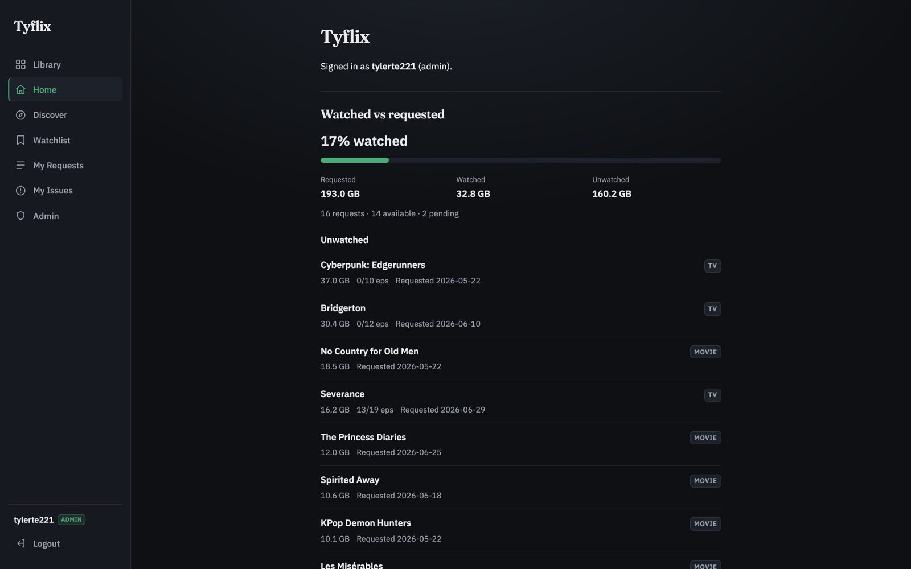
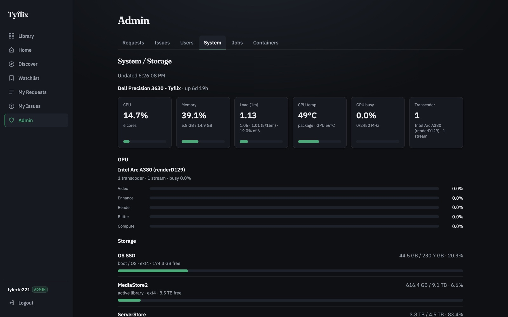
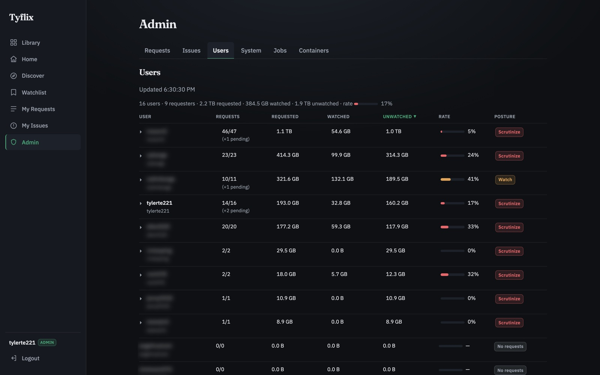

# Tyflix

Tyflix puts a real front door on a Plex server. Browse, request, see what's already in the library, play it. All behind a Plex login.

It sits on top of Seerr, the request manager in the Overseerr and Jellyseerr family, which handles the pipeline into Radarr and Sonarr. Tyflix adds the parts Seerr leaves thin for what I needed: a poster-forward browse experience, in-browser playback, per-user analytics, and an admin view of the server itself. The point was that nobody in my house should ever have to open Radarr.

**Live instance:** https://tyflix.tylerte.dev (you need a Plex account with access to the server to sign in)

**Reading the code?** [docs/CODE_TOUR.md](docs/CODE_TOUR.md) is a guided way in: which ten files carry the architecture, what order to read them in, and the design decisions worth arguing with.

Deployed, in daily use, still being built. Roadmap's at the bottom.

## Screenshots

**Discover.** Global trending from TMDB with live Plex availability layered on top. Green means it's already on the server, amber means partial.



**Library.** What's actually on the server, Plex-style, opening on a Continue Watching rail. Search by title, sort, filter by genre or unwatched, jump with the A-Z rail, resize the posters. Progress bars and watched badges read live from Plex.



**Search.** Type a few letters and the whole library filters, not just the page you happen to be looking at, because the filtering runs on Plex's side rather than in the browser. It matches anywhere in the title, so "dragon" pulls up every Dragon Ball film without me spelling one out.



**Title page.** Artwork, overview, cast and crew, availability, and one button that's either Play or Request depending on what the server already has.



**In-browser player.** Movies and episodes stream from Plex, transcoded on the fly. The control bar is custom: playback speed, resolution, audio track (commentary included), subtitles.



**Resume where you left off.** Playback position syncs back to Plex, so a half-watched title offers to pick up at the exact second you stopped. Doesn't matter whether you last watched in Tyflix or on the TV in the other room.



**Up Next.** Episodes auto-advance off the credits marker, with the Plex-style card and countdown.



**Home.** Your own watched-versus-requested numbers. How much you asked for, how much you actually watched, how much is sitting there untouched.



**Admin, system and storage.** Host CPU, memory, load, temperatures, GPU transcode engines, per-volume storage. Proxied live off the server.



**Admin, per-user analytics.** The same watched-versus-requested split across every account, with a posture flag for people who request far more than they ever watch. Other users' names are blurred here.



## Everything else in there

Beyond what's in the screenshots:

- Full TMDB discovery: search, browse by genre, recommendations, cast and crew, collections, studio and network pages.
- Requests flow through Seerr into Radarr and Sonarr, which do the actual downloading and library management. Tyflix doesn't reimplement any of that.
- Report a problem on a title, like bad audio or the wrong cut, and follow it through to resolution.
- Plex Watchlist, per-user request quotas, and quality-profile selection at request time.
- Cast to a Chromecast from the player. Playback moves to the TV and keeps reporting progress to Plex. Stop casting and the browser picks up wherever the TV got to.
- People who don't have access yet can ask for it. A short form at `/request-access` lands in the admin area, and one approval sends a real Plex library invite.
- Admins can remove a title from the library: a whole movie or series, or just one season or episode. Removing something also blocklists it, so the watchlist sync that runs every few minutes doesn't quietly download it again. There's a blocklist view in the admin area to undo that.
- The admin area also covers running jobs, container health, and user management.

## Architecture

Tyflix is one Node service. It serves a JSON API and the built React app from the same origin.

- **Frontend:** React, Vite, TypeScript. Dark, poster-forward, persistent sidebar.
- **Backend:** Node, Express, TypeScript. It holds every credential and talks to four upstreams: Plex for accounts and the library, Seerr for requests and media status and issues, TMDB for discovery metadata and images, and a small host-metrics service that feeds the admin dashboard.
- **Auth:** users sign in with their Plex account over Plex's PIN flow. The browser only ever holds a signed, httpOnly session cookie. The Plex token stays on the server.
- **Playback:** the server mints a short-lived Plex *transient* token from the user's stored token and hands the browser Plex's own `plex.direct` address, so video goes straight from Plex to the in-page player and never touches the tunnel. Plex transcodes on demand. The durable token never leaves the backend.
- **Deployment:** the whole thing runs in Docker on a home server, on the same Docker network as Seerr, reachable from anywhere through a Cloudflare Tunnel. No inbound ports are open on the home network. TLS terminates at Cloudflare's edge. Pushing to main runs the test suite and deploys only if it passes.

```
Browser --https--> Cloudflare edge --tunnel--> cloudflared --> Tyflix (Node)
  |                                                              |-> Seerr --> Radarr / Sonarr
  |                                                              |-> Plex
  |                                                              |-> TMDB
  |                                                              |-> metrics
  `-------------------- video, direct to Plex over HTTPS ---------------------------->
```

Only the control plane goes through the tunnel. Video streams direct from the browser to Plex over HTTPS.

## Notable engineering decisions

**Outbound-only public access, a reverse-invoke model.** The app runs at home and is reachable from anywhere with no inbound port open on the network. The obvious way to do this is to forward a port on the router, which puts a service straight on the public internet. I didn't want that, so access runs on a broker-mediated, outbound-only model built on a Cloudflare Tunnel. A lightweight connector (cloudflared) sits next to the app and dials out to Cloudflare's edge, holding a connection open from the inside. Cloudflare acts as the broker: a request arrives for the public hostname, the edge pushes it back down that already-open connection, and the connector hands it to the app over the local Docker network. Every connection starts inside the network and goes out. The router never accepts unsolicited inbound traffic, and TLS and edge filtering happen at Cloudflare.

It's the same shape as an enterprise pattern like SAP Cloud Connector reaching SAP BTP. The on-premise side opens the tunnel outbound and the cloud reverse-invokes back through it. Publicly reachable service, closed perimeter.

**Streaming video without pushing it through the tunnel.** Everything else in the app rides the outbound tunnel. Video is the deliberate exception. Proxying a movie through Cloudflare would be slow and outside the terms for that path, so playback streams straight from Plex to the browser instead. When a user hits play, the server mints a short-lived Plex *transient* token from their stored token (the long-lived one never reaches the browser) and returns Plex's own direct address, both a local one and a remote one, so the player uses whichever it can actually reach. Plex transcodes on demand, forced to H.264, so anything in the library plays in a browser no matter what codec it was ripped in. Control plane behind the tunnel, video direct.

**Rate limiting that sees the real client.** Sitting behind the tunnel means every request arrives from the tunnel's address rather than the user's, so a naive per-IP limiter treats all traffic as one client. The limiter keys on the `CF-Connecting-IP` header, which Cloudflare sets and overwrites so a client can't forge it, and falls back to the socket address for local development. The limit itself got tuned after I throttled myself: the admin dashboard polls a few endpoints every couple of seconds, and an early, tighter limit locked the admin out of their own page inside a single window.

**Security that doesn't depend on the code being private.** Authorization all happens on the server. Every route checks the session, and admin routes check an admin permission bit that mirrors Seerr's model. The long-lived Plex token never leaves the backend. Security headers ship a Content-Security-Policy scoped to exactly what the app loads: posters from TMDB, fonts from Google, everything else same-origin. The one awkward exception is the Plex login popup, which needs a Cross-Origin-Opener-Policy loose enough that the opener keeps a handle on the popup and can close it once sign-in completes.

**Letting strangers ask for access without opening anything up.** The request form is the only part of the app you can reach without an account, so it's the only part anyone can abuse. I skipped the CAPTCHA. An abusive submission is already inert, because approval gates everything behind it: no email goes out, no Plex call fires, no account gets made. It's a row that only I see. What's left is a crawler hammering the form, and a hidden honeypot field plus a per-IP hourly cap deals with that without asking real people to prove they're human. Approving calls Plex's sharing API to invite the email and grant whichever libraries I picked. Denials stop blocking a resubmission after 90 days, so a no isn't permanent. The queue also reconciles against Plex on every read, so a request that got accepted some other way doesn't sit there looking pending.

**Joining two id systems.** Discovery is keyed by TMDB id. Plex is keyed by its own rating keys. Availability and playability come from matching the two through Seerr's media records, which is how the app shows accurate status instead of guessing by title.

## Tech stack

- TypeScript across frontend and backend
- React and Vite, with hls.js for in-browser playback
- Node and Express
- Docker for packaging, Cloudflare Tunnel (cloudflared) for access
- Helmet and express-rate-limit for security headers and request throttling
- Integrations: Plex, Seerr, TMDB, Radarr, Sonarr

## Getting started

```bash
npm install
cp .env.example .env     # then fill it in
npm run dev              # server on :4000, Vite on :5173
```

`npm run dev` runs both workspaces together. The server needs Plex, Seerr and
TMDB credentials to do anything useful; see `.env.example` for the eleven keys.

```bash
npm test -w server       # 479 tests, built-in Node runner
npm run build            # typecheck + Vite build + tsc
```

In production the server serves the built SPA from the same origin, so there's
one process and one port.

## Status and roadmap

Tyflix is deployed and in daily use on my home server, and it's still an active work in progress. It covers most of Seerr's user-facing surface plus a few things Seerr doesn't do, like the per-user watched-versus-requested analytics. The backend carries 479 tests and the frontend 65.

Recent work: admin media removal, including per-season and per-episode deletion that Seerr doesn't offer, and a blocklist so a removal actually sticks against the watchlist sync. Before that, a mobile overhaul, search in the Library, self-serve access requests where a stranger's form submission becomes a real Plex invite once I approve it, and casting to a Chromecast. Earlier came the in-player control bar, auto-advance with the Up Next card, hardware-accelerated transcoding on the server's Arc GPU, and progress sync back to Plex. That last one made watch state per-user instead of owner-based, which is what makes the Continue Watching rail and the per-poster progress bars mean anything.

Next up: an automatic bitrate cap for constrained connections, and AirPlay, so casting also works from Safari and iOS.

Wherever I can, I'd rather wire up a tool that already works than rebuild it. Tyflix is a layer over Plex and Seerr, not a second copy of either.

## Notes

Personal project, self-hosted, not affiliated with Plex. It doesn't host or distribute media; it manages access to a private Plex library. This repository is application code only. Deployment details specific to my own network stay out of it.
