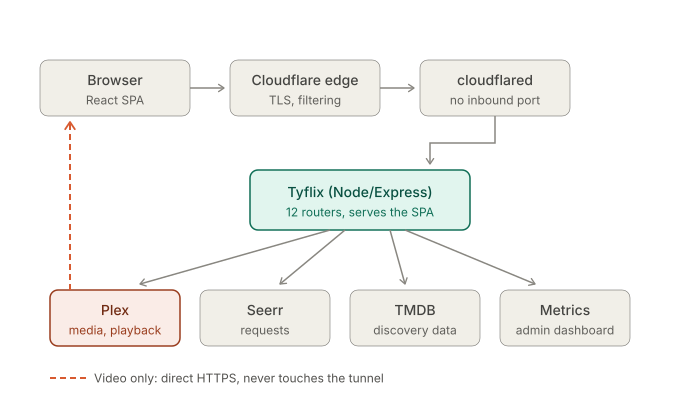

# Code tour

_Last verified against `aedb123`, 2026-08-03._

Tyflix is 101 source files, about 31,600 lines, split across a Node/Express
backend and a React SPA. Ten files carry the architecture, and the rest are
leaves hanging off them; this doc surfaces those ten early and tiers everything
else behind them. Worth knowing before you budget time: six files alone carry
9,447 lines, 30% of the repo (`AdminPage.tsx` 2,145, `WatchPage.tsx` 1,845,
`seerr/client.ts` 1,679, `plex/server.ts` 1,503, `PlayerControls.tsx` 1,186,
`tmdb/client.ts` 1,089). The tiering below doesn't surface that concentration
on its own.

Every file also has a header comment explaining what it is and where it sits,
so once you're in the code you can keep orienting without coming back here.

**Contents**

- [Read this first](#read-this-first)
- [Decisions worth asking about](#decisions-worth-asking-about)
- [The system on one page](#the-system-on-one-page)
- [The spine](#the-spine)
- [Reading paths by topic](#reading-paths-by-topic)
- [Conventions you'll see everywhere](#conventions-youll-see-everywhere)
- [File reference, tiered](#file-reference-tiered)
- [Where the rest of the docs are](#where-the-rest-of-the-docs-are)

## Read this first

The [README](../README.md) covers what the product is and has screenshots. If
you need to run this locally, it also has the install and test commands under
Getting Started. Read it before any code; the rest of this doc assumes you know
what the app does from a user's point of view.

Two things to know before you open a file:

**This is a layer, not a rebuild.** Plex holds the media and does the
transcoding. Seerr runs the request pipeline into Radarr and Sonarr. TMDB
supplies discovery metadata. Tyflix orchestrates those three and adds what none
of them do: a poster-forward browse experience, in-browser playback, per-user
analytics, and self-serve access. If you find yourself looking for the
downloader, it isn't here on purpose.

**Most of the complexity is one problem.** Discovery is keyed by TMDB id. Plex
is keyed by its own `ratingKey`. Those two id systems have to be reconciled
before the app can say "you can play this" instead of "this movie exists
somewhere." A surprising amount of the code is that join.

## Decisions worth asking about

The parts of this project where the interesting thinking is, and what I'd have
had to give up to do them another way.

### Public access with no inbound port open

The app runs at home and is reachable from anywhere, and the router accepts no
unsolicited inbound traffic.

The obvious approach is a port forward, which puts a service straight on the
public internet. I didn't want that. Access instead runs outbound-only: a
`cloudflared` connector sits next to the app and dials out to Cloudflare's edge,
holding a connection open from the inside. A request arrives for the public
hostname, the edge pushes it back down that already-open connection, and the
connector hands it to the app over the local Docker network. Every connection
starts inside the network. TLS and edge filtering happen at Cloudflare.

It's the same shape as SAP Cloud Connector reaching SAP BTP: the on-premise side
opens the tunnel outbound and the cloud reverse-invokes back through it.

**Trade-off:** everything now depends on Cloudflare being up, and it puts a third
party in the path of all control-plane traffic.

**Where to look:** deployment sits outside this repo by design, but the tunnel
shapes the code in two visible places, the rate limiter's IP handling and the
decision below.

### Video does not go through the tunnel

Every other request rides the tunnel. Video is the deliberate exception.
Proxying a movie through Cloudflare would be slow and outside the terms for that
path, so playback streams straight from Plex to the browser.

That creates a credential problem, and it's worth counting all four credentials
that end up in play so they don't get conflated: the user's Plex *account*
token from the PIN login flow, their *per-server* token that the media server
actually accepts for non-owners (see Per-server Plex tokens, below), the
disposable Plex *transient* token minted fresh for each play, and the session
cookie itself. Only the transient token and the cookie ever reach the browser.
The account and per-server tokens never leave the backend, and the cookie
carries the account token only as an AES-256-GCM-encrypted blob it can't read.

The fix: on play, the server mints a short-lived transient token from the
user's per-server token and returns Plex's own direct address, both local and
remote, so the player uses whichever it can reach. The transient is valid
roughly 48 hours or until the PMS restarts, so it doesn't expire mid-movie in
any normal session; if one somehow did, the symptom is a fatal hls.js error,
the player retries once against the other address, and a further failure
surfaces as a visible error rather than a silent dead player. There's no
automatic re-mint, so reloading playback is what gets a fresh one. Plex
transcodes on demand, forced to H.264, so anything in the library plays in a
browser regardless of how it was ripped.

**Trade-off:** a transient token does reach the browser. It's short-lived and
scoped, which is the point, but it's a real widening of the trust boundary
compared to proxying everything.

**Where to look:** `server/src/routes/watch.ts`, `plex/transientToken.ts`,
`plex/connection.ts`, `plex/transcodeUrl.ts`.

### Joining two id systems

Discovery is TMDB-keyed. Plex is `ratingKey`-keyed. Availability and playability
come from matching them through Seerr's media records, which is how the app shows
accurate status instead of guessing by title.

Title matching would have been simpler and would have been wrong constantly:
remakes, re-releases, regional titles, and any show with a common word in its
name.

**Trade-off:** it makes Seerr a hard dependency for something that isn't
conceptually about requests. If Seerr is down, availability degrades to unknown
rather than the app guessing.

**Where to look:** `server/src/seerr/mediaStatusProvider.ts`, then
`routes/discover.ts` where `annotateMediaStatus` layers status onto results, and
`web/src/components/MediaCard.tsx` for where the availability badge actually
renders.

### Per-server Plex tokens

A shared Plex user has an account token and, separately, a token for each server
they've been given access to. The media server only accepts the per-server one
for non-owners.

I stored the account token. Everything worked in testing, because I was testing
as the owner, whose account token *is* accepted. It broke sign-in for all 14
shared users simultaneously, and re-logging-in couldn't fix it because the app
would just store the wrong token again.

**Where to look:** `plex/resolvePmsToken.ts` and `plex/sharedServerAccess.ts`.
The whole 33-line file exists to make the right choice hard to get wrong twice.

### Rate limiting behind a tunnel

Behind the tunnel, every request arrives from the tunnel's address, so a naive
per-IP limiter treats all traffic as one client. The limiter keys on
`CF-Connecting-IP`, which Cloudflare sets and overwrites so a client can't forge
it, and falls back to the socket address for local development.

The limit itself got tuned after I locked myself out: the admin dashboard polls
several endpoints every few seconds, and an early tighter limit 429'd the admin
inside a single window.

**Where to look:** `server/src/middleware/rateLimit.ts`.

### Letting strangers ask for access without opening anything up

The request form is the only part of the app reachable without an account, so
it's the only part anyone can abuse. I skipped the CAPTCHA.

An abusive submission is already inert, because approval gates everything behind
it: no email goes out, no Plex call fires, no account is created. It's a row only
I see. What's left is a crawler hammering the form, and a hidden honeypot field
plus a per-IP hourly cap handles that without asking real people to prove they're
human. Approving calls Plex's sharing API to invite the email and grant the
libraries I picked.

**Trade-off:** a determined human can still submit junk. The cost of that is a
row in a JSON file, which I judged cheaper than a CAPTCHA on every legitimate
visitor.

**Where to look:** `routes/accessRequests.ts`, `routes/adminAccessRequests.ts`,
`accessRequests/store.ts`, `plex/sharing.ts`.

### Authorization is entirely server-side

The SPA hides admin navigation, but that's tidiness, not security. Nothing is
protected until `requireAuth` or `requireAdmin` runs on the server, and the admin
check reads a permission bit mirroring Seerr's model. The long-lived Plex token
never leaves the backend.

This matters because the repository is public. None of the security depends on
the code being secret.

**Where to look:** `server/src/middleware/auth.ts`, then `session.ts` for
`isAdmin` and the cookie format.

## The system on one page

One Node process serves the JSON API and the built React app from the same
origin.



The video bypass shown above is deliberate. See [Video does not go through the tunnel](#video-does-not-go-through-the-tunnel) for why.

There's no database. The only thing Tyflix itself persists to disk is
`accessRequests/store.ts`: a JSON file with serialized writes and an atomic
rename. Everything else is either carried in the signed session cookie or asked
for fresh from Plex, Seerr, or TMDB on each request; watch progress, for
instance, is Plex's to keep, not ours. The server only reports it there.

Backend layout, in dependency order:

```
config.ts        env in, validated config out, exits the process if anything's missing
   ↓
index.ts         builds every client once, mounts every router  ← the map of the backend
   ↓
routes/          one router per API surface, each behind requireAuth or requireAdmin
   ↓
plex/ seerr/ tmdb/ dashboard/     typed clients for the four upstreams
```

The frontend mirrors it:

```
main.tsx      mounts React inside BrowserRouter + AuthProvider
   ↓
App.tsx       the route table  ← the map of the frontend
   ↓
pages/        14 screens, one per route
   ↓
api/          11 clients, one per backend router
```

If you read only two files, read `server/src/index.ts` and `web/src/App.tsx`.
They're the two tables of contents.

## The spine

Ten files, in dependency order. The first five cover the architecture; all ten
cover everything load-bearing.

| # | File | LOC | Why it's here |
|---|---|---|---|
| 1 | [`server/src/index.ts`](../server/src/index.ts) | 380 | Composition root and routing table. Shows every upstream, every route, the middleware order, and which routes are public. Two mount-order rules are load-bearing: public routes (auth, config, access-requests) must mount before the catch-all `/api` 404 guard, and `/api/admin/access-requests` must mount before `/api/admin`, since Express matches path prefixes in registration order. |
| 2 | [`web/src/App.tsx`](../web/src/App.tsx) | 94 | Every URL the app answers, and its three access tiers: public (`/login`, `/request-access`), authenticated (everything behind `ProtectedRoute`), and admin-only (`/admin`, behind `AdminRoute` stacked on top). |
| 3 | [`server/src/session.ts`](../server/src/session.ts) | 410 | How a logged-in user is represented: signed cookie, and the Plex account token encrypted inside it with AES-256-GCM. Also `isAdmin`, the single place admin is decided. |
| 4 | [`server/src/routes/watch.ts`](../server/src/routes/watch.ts) | 810 | Playback, eight endpoints. The most interesting is `GET /movie/:tmdbId`, which resolves a TMDB id to a ratingKey, mints a short-lived Plex token, and hands back a direct address. |
| 5 | [`server/src/seerr/mediaStatusProvider.ts`](../server/src/seerr/mediaStatusProvider.ts) | 150 | 150 lines that explain half the codebase: the TMDB-id to Plex-ratingKey join. In-memory cache, 60-second TTL, shared by the four routers that need it (discover, watchlist, issues, watch). A Seerr outage drops the cache rather than serving it stale, so availability reads as unknown instead of wrong. |
|  | *stop here if you have twenty minutes* | | |
| 6 | [`server/src/plex/connection.ts`](../server/src/plex/connection.ts) | 267 | Resolves the `plex.direct` addresses a browser can stream from, local and remote, so the player picks whichever it can reach. |
| 7 | [`server/src/plex/transientToken.ts`](../server/src/plex/transientToken.ts) | 136 | Trades the durable Plex token for a short-lived one, valid roughly 48 hours or until the PMS restarts. This is what lets video go direct without the real credential leaving the server. |
| 8 | [`server/src/plex/resolvePmsToken.ts`](../server/src/plex/resolvePmsToken.ts) | 33 | 33 lines, and worth every one. A shared Plex user's account token is not their token for a specific server. Getting this wrong broke sign-in for all 14 shared accounts at once. |
| 9 | [`web/src/pages/WatchPage.tsx`](../web/src/pages/WatchPage.tsx) | 1,469 | The client half of playback: hls.js, resume, Up Next auto-advance, cast handoff. Read its header first; it maps the twelve effects before you meet them. |
| 10 | [`server/src/routes/auth.ts`](../server/src/routes/auth.ts) | 241 | Plex's PIN login flow end to end, and where the session cookie gets issued. |

## Reading paths by topic

Pick the one you care about. Each path is in dependency order.

**How does login work?**
`routes/auth.ts` → `plex/client.ts` (the plex.tv PIN flow) → `session.ts` (cookie
issued) → `middleware/auth.ts` (cookie enforced) → `web/src/pages/LoginPage.tsx`
(the popup and poll) → `web/src/auth/AuthContext.tsx` (what the client knows).

**How does playback work?**
`routes/watch.ts` → `plex/resolvePmsToken.ts` → `plex/transientToken.ts` →
`plex/connection.ts` → `plex/transcodeUrl.ts` → `web/src/api/watch.ts` →
`web/src/pages/WatchPage.tsx` → `web/src/components/PlayerControls.tsx`.

**How does requesting a title work?**
`web/src/pages/MediaDetailPage.tsx` → `web/src/api/requests.ts` →
`routes/requests.ts` → `seerr/client.ts`. Seerr takes it from there into Radarr
or Sonarr.

**How does browsing the actual library work?**
`routes/library.ts` → `plex/server.ts` → `web/src/api/library.ts` →
`web/src/pages/LibraryPage.tsx`. Note that search, sort and filter all run on
Plex's side, not in the browser, which is why typing filters the whole library
rather than the page you're looking at.

**How does casting work?**
`web/src/cast/initCast.ts` → `cast-globals.d.ts` (hand-written types, the SDK
comes off a CDN) → `useCastState.ts` → `subscribeSessionReady.ts` →
`loadMediaOnCast.ts` → `useCastPlayer.ts`. Cast uses DASH while the browser uses
HLS, because the Cast receiver couldn't play Plex's HLS output.

**How do access requests work?**
`web/src/pages/RequestAccessPage.tsx` → `routes/accessRequests.ts` →
`accessRequests/store.ts` → `routes/adminAccessRequests.ts` → `plex/sharing.ts`.

**How does the admin console work?**
`web/src/pages/AdminPage.tsx` (seven tabs, one map at the top of the file) →
`web/src/hooks/usePolledResource.ts` → `web/src/api/admin.ts` →
`routes/admin.ts` → `dashboard/client.ts`.

## Conventions you'll see everywhere

**Factory functions with hand-rolled dependency injection.** Nearly everything is
`createSomething(deps)` returning an object of methods: `createPlexClient`,
`createWatchRouter`, `createSeerrClient`. There's no DI container and no mocking
framework. `index.ts` wires the real implementations; tests pass fakes to the same
factories. That one pattern is why the backend has 479 tests and no `jest.mock`.

**Routers are built, not imported.** Each file in `routes/` exports
`createXRouter(deps)`. Mount paths live only in `index.ts`, so that's where you
check what a route's real URL is.

**`res.locals.session`** carries the decoded session after `requireAuth`. If you
see a handler read it, authentication already happened upstream.

**Upstream failures answer 502.** Each router catches its client's error type and
returns 502 with the upstream message, rather than letting a Plex or Seerr outage
read as a bug in Tyflix.

**Types are the documentation for shapes.** The clients convert upstream
snake_case into camelCase at the boundary, so a `MediaSummary` in the frontend is
the same shape the backend promised. Field-level comments carry units and what
null means.

**Tests sit next to sources** as `*.test.ts`, 25 files, run with the built-in
Node test runner. They're a good source of truth for real upstream response
shapes, since the fixtures came from live responses.

## File reference, tiered

### The rest, by topic

Grouped by concern. Open these when a path above leads you here.

**Configuration**

| File | LOC | What it is |
|---|---|---|
| `server/src/config.ts` | 213 | Every env var, validated once at boot. Fails loud and exits rather than starting half-configured. |

**Auth and access control**

| File | LOC | What it is |
|---|---|---|
| `server/src/middleware/auth.ts` | 60 | `requireAuth` and `requireAdmin`. The only two gates. |
| `server/src/middleware/rateLimit.ts` | 77 | Two limiters, keyed on `CF-Connecting-IP`. |
| `server/src/plex/client.ts` | 223 | The plex.tv account API. Not to be confused with `plex/server.ts`. |
| `web/src/auth/AuthContext.tsx` | 133 | The client's whole view of the session. |
| `web/src/auth/ProtectedRoute.tsx` | 63 | `ProtectedRoute` and `AdminRoute`, both layout routes. |
| `web/src/pages/LoginPage.tsx` | 212 | The popup-and-poll PIN flow. |

**The Plex integration**

| File | LOC | What it is |
|---|---|---|
| `server/src/plex/server.ts` | 1,503 | The media server's HTTP API: sections, metadata, episodes, artwork, watch state, timeline. Biggest backend file, and dense with Plex quirks the header enumerates. |
| `server/src/plex/transcodeUrl.ts` | 202 | Builds the universal-transcode URLs, HLS for browser and DASH for Cast, forcing H.264. |
| `server/src/plex/sharedServerAccess.ts` | 215 | Resolves each shared user's per-server token. |
| `server/src/plex/sharing.ts` | 478 | Library sharing: invites, shareable sections, acceptance state. |
| `server/src/routes/library.ts` | 403 | Browsing what's on the server. Five endpoints, including the artwork proxy. |

**Discovery, requests, and issues**

| File | LOC | What it is |
|---|---|---|
| `server/src/seerr/client.ts` | 1,244 | The whole Seerr surface in one typed client. |
| `server/src/tmdb/client.ts` | 1,089 | Read-only TMDB: search, trending, genres, credits, collections. |
| `server/src/routes/discover.ts` | 463 | Twelve browse endpoints. Exports `annotateMediaStatus`, which other routers import. |
| `server/src/routes/requests.ts` | 371 | Create a request, list your own, and the admin approve/decline queue. |
| `server/src/routes/issues.ts` | 438 | Report-a-problem, with per-issue authorization rather than per-route. |
| `server/src/seerr/issues.ts` | 248 | Seerr's issue enums and nested parsing, split out of the client. |
| `server/src/tmdb/enrichment.ts` | 116 | Cached title-and-poster lookup for Seerr rows, which carry ids but no artwork. |

**Analytics, admin, and access requests**

| File | LOC | What it is |
|---|---|---|
| `server/src/analytics/watchedVsRequested.ts` | 214 | The watched-versus-requested numbers, weighted by bytes rather than title count. Pure function. |
| `server/src/accessRequests/store.ts` | 483 | Access-request records: pending, approved, denied. The durable state discussed above. |
| `server/src/routes/adminAccessRequests.ts` | 513 | Approvals, which fire real Plex invites, plus reconciliation against Plex on read. |
| `server/src/routes/accessRequests.ts` | 211 | The public submit endpoint. Honeypot, per-IP cap, identical responses either way. |
| `server/src/routes/admin.ts` | 68 | Read-only proxy to the metrics service. |
| `server/src/routes/adminMedia.ts` | 695 | Removing media: a whole title, one season, or one episode. The header explains what "remove" means across Radarr/Sonarr, Plex, Seerr's media row and its open requests. |
| `server/src/routes/adminBlocklist.ts` | 332 | The blocklist, which is what stops a removed title being auto-requested again. Removing an entry is the undo, and it warns that the title becomes re-requestable. |
| `server/src/sonarr/client.ts` | 434 | Sonarr v3, used only for what Seerr has no API for: per-season and per-episode removal. Two traps documented in the header, both live-tested. |
| `server/src/dashboard/client.ts` | 91 | The metrics service client. |
| `server/src/routes/me.ts` | 192 | Home-page stats and Seerr quota. |

**Key frontend screens and shared UI**

| File | LOC | What it is |
|---|---|---|
| `web/src/pages/AdminPage.tsx` | 1,807 | Seven-tab admin console. Largest file in the repo; its header maps every tab with its endpoint and poll interval. |
| `web/src/pages/LibraryPage.tsx` | 674 | Default landing page. Plex-side search, sort, genre and unwatched filters, A-Z rail. |
| `web/src/pages/MediaDetailPage.tsx` | 871 | The title page and the Play-or-Request decision. |
| `web/src/pages/RequestAccessPage.tsx` | 495 | Four-step public wizard. |
| `web/src/pages/DiscoverPage.tsx` | 406 | TMDB trending with availability layered on. |
| `web/src/components/PlayerControls.tsx` | 1,062 | Custom control bar. Quality and audio changes restart the Plex transcode in place; subtitles are burned in. Both explained in the header. |
| `web/src/components/ManageMediaModal.tsx` | 730 | The admin Manage view: a title's requests, whole-title removal, and for TV a collapsible season/episode tree. Every destructive control is two-click, and only one can be armed at a time. |
| `web/src/components/Modal.tsx` | 106 | Generic dialog shell. No focus trap, deliberately, matching `BottomSheet`; the header says why rather than leaving it to look like an oversight. |
| `web/src/hooks/usePolledResource.ts` | 147 | The polling hook every admin panel runs on. Stale data survives a failed poll. |
| `web/src/api/watch.ts` | 441 | Play descriptors, episode lists, subtitle selection, timeline reporting. |
| `web/src/api/discover.ts` | 440 | The TMDB half of the frontend, and the file carrying the shared fetch conventions the other clients reference. |

**Cast**

| File | LOC | What it is |
|---|---|---|
| `web/src/cast/initCast.ts` | 183 | Bootstraps the CAF sender SDK from Google's CDN. Called once in `main.tsx`, outside React. |
| `web/src/cast/cast-globals.d.ts` | 239 | Hand-written ambient types, because the SDK isn't an npm package. |
| `web/src/cast/useCastPlayer.ts` | 299 | Mirrors receiver state into React and exposes the four transport commands. |
| `web/src/cast/useCastState.ts` | 159 | Can we cast, are we connected, and the toggle. |
| `web/src/cast/subscribeSessionReady.ts` | 99 | Fires when a session can actually accept media. The obvious signal, `CAST_STATE_CHANGED` reaching `CONNECTED`, can arrive before the receiver will accept a load; this waits for `SESSION_STATE_CHANGED`'s `STARTED`/`RESUMED` instead. |
| `web/src/cast/loadMediaOnCast.ts` | 115 | The only `loadMedia` call. DASH plus Plex's required `/decision` handshake. |

**Installing as an app**

| File | LOC | What it is |
|---|---|---|
| `web/index.html` | 148 | Mostly install plumbing now: the manifest link, the icons, and 40 `apple-touch-startup-image` links. iOS won't read the manifest's background color and won't generate a launch screen, so every screen size and orientation needs its own image. Two things in here look like mistakes and aren't, both commented in place. Landscape entries carry the *portrait* `device-width` and `device-height`, because Apple matches the physical screen rather than the current rotation. And `-webkit-device-pixel-ratio` is load-bearing, because `414x896` exists at both 2x and 3x and picks a different file at each. |
| `web/public/manifest.webmanifest` | 33 | `display: standalone`, scope, theme and background color, and three icons, one of them `maskable` and inset to survive Android's adaptive-icon crop. Everything in `web/public/` gets copied to the build root by Vite and served by `express.static` ahead of the SPA fallback, which is what lets a browser fetch the manifest while logged out. |

### Leaves

37 files not covered above: pages, components, API clients, and small modules.
Each one is small and single-purpose, with a header comment explaining what it
does. Run this for the full inventory with line counts:

```bash
find server/src web/src \( -name '*.ts' -o -name '*.tsx' \) ! -name '*.test.ts' ! -name '*.test.tsx' | xargs wc -l | sort -n
```

## Where the rest of the docs are

**In this repo:** the [README](../README.md), this tour, and a header comment on
every source file. Between those you shouldn't have to reverse-engineer
anything.

**Not in this repo:** I keep a long handoff document and a per-increment design
spec for each phase, each with a Considered / Rejected / Chosen decision log.
Those stay local because they carry deployment specifics about my own network.
This tour is written to stand on its own without them, so if something here
leaves you with a question the code can't answer, that's a gap in this doc
rather than a pointer to somewhere you can't reach. Say so and I'll fix it.
